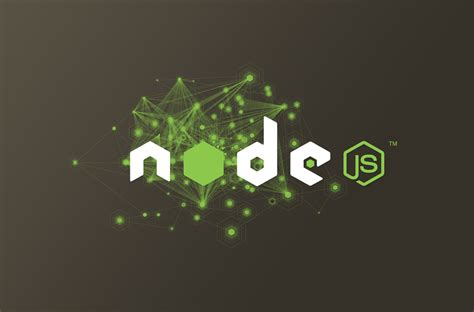

# Branch Back end
# Ver O PESO Virtual

### Participante: 
|name | email | occupation | course |
| -------- | -------- | -------- |-------- | 
|Isaque Menezes| isaque-menezes@hotmail.com| developer back-end| Sistemas de Informação|

## Linguagens, libs e outros utilizadas :books:

- [VISUAL STUDIO CODE](https://code.visualstudio.com)
- [GIT](https://git-scm.com)
- [NODEMON](https://www.npmjs.com/package/nodemon)
- [EXPRESS](https://expressjs.com/)

### Customização commits 

1. FIX: Resolve um bug

2. FEAT: Inicia a implementação de uma feature.

3. CHORE: Trabalho em progresso de uma feature.

4. REFACTOR: Ajuste sem mudar lógica - Refatoração.

5. TEST: Implementa testes automatizados.

6. STYLE: Mudança de formatação do código - lint

7. PERF: Ajustes de performance

8. DOCS: Insere documentação

9. CI: Ajuste nas configurações do CI

10. BUILD: Ajuste nas configurações de build.

# Como rodar o project baixado

## Instalar todas as dependêcias indicadas no package.json
`npm install`

## Rodar o project
## Execute o server
`nodemon server.js`

## Depenciais do Project:
### Depência para gerenciar rodas, requisições, url entre outras. express
`npm install express`

### Reiniciando automaticamente o aplicativo de nó com nodemom quando são detectadas alterações de arquivo no diretório.
`npm install --save-dev nodemon`

### Templates handlebars
`npm install --save express-handlebars`

### MYSQL db 
`npm install --save mysql2` 

### camada de aplicação do dados 
`npm install --save body-parser`
